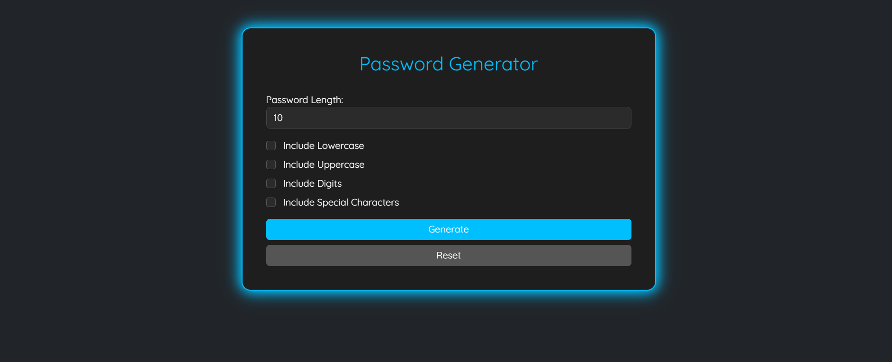
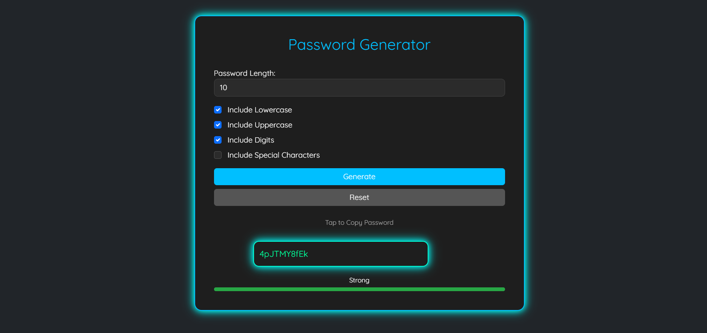

# 🔐 Password Generator

A modern, glowing password generator with a clean dark-themed UI built using **Flask**, **HTML/CSS**, and **JavaScript**. It features a real-time password strength meter, animated neon effects and copy-to-clipboard functionality. The UI is responsive, interactive, and includes accessibility-friendly elements.

---

## ✨ Features

- ✅ Generate Secure Passwords : Customize password length (6–32 characters)
- 🔠 Flexible Character Selection : Choose from lowercase, uppercase, digits, and special symbols
- 📊 Real-Time Strength Meter : Animated progress bar with color-coded feedback (Red/Yellow/Green)
- 📋 One-Click Copy : Instantly copy passwords using the Clipboard API
- 🌌 Dark-Themed UI : Glowing neon borders and modern styling
- 🌀 Smooth Animations : Password fade-in, button hover effects, glowing container transitions
- 📱 Fully Responsive Design : Optimized for both desktop and mobile devices
- 🧠 Lightweight Tech Stack: Built with Flask, clean Jinja templating, vanilla JS, and custom CSS

---

## 🚀 Tech Stack

- Backend: **Python (Flask)**
- Frontend: **HTML5, CSS3, JavaScript**
- Styling: **Bootstrap (minimal)** + **Custom CSS Animations**

---

## 📸 Demo Preview

  
  

---

## 📁 Folder Structure

```
📦 password-generator/
├── app.py
├── static/
│   └── style.css
├── templates/
│   └── index.html
├── README.md
└── screenshots/
```

---
## 🙌 Author

Built with 💖 by Amrita

